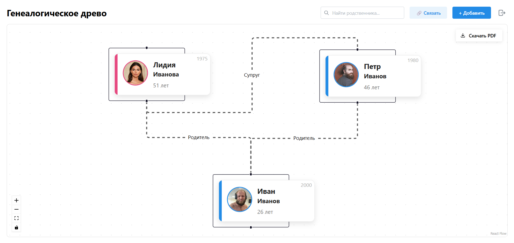
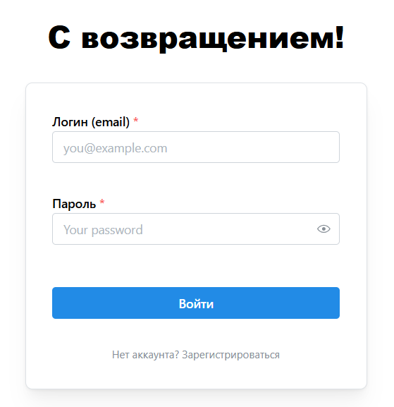
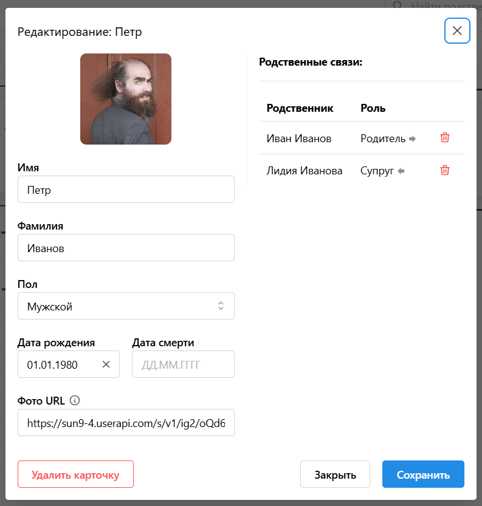

# 🌳 Генеалогическое древо (Family Tree App)

Веб-приложение для построения, визуализации и хранения истории семьи. Pet-проект, обладающий полноценным функционалом для ведения семейного архива.



## ✨ Возможности

- **📊 Интерактивный граф:** Визуализация связей с помощью React Flow. Автоматическая иерархическая расстановка (родители выше, дети ниже) + сохранение ручного перемещения карточек.
- **🔒 Многопользовательский режим:** Система регистрации и авторизации. Каждый пользователь видит и редактирует только своё дерево.
- **🛠 Полный контроль данных:** - Добавление людей с фото, датами рождения/смерти и полом.
  - Создание связей различных типов (Родитель, Супруг, Брат/Сестра).
  - Умное редактирование: при клике на человека связи подписываются относительно него (например, "Отец", "Сын").
- **🔍 Умный поиск:** Мгновенная фильтрация по дереву с визуальной подсветкой результатов.
- **📄 Экспорт в PDF:** Возможность скачать изображение всего дерева в высоком качестве одной кнопкой.
- **🎨 Современный UI:** Чистый дизайн (шрифт Inter, приятная цветовая гамма), адаптивные модальные окна, календари.

## 📸 Скриншоты

### Вход и регистрация



### Редактирование персоны



## 🛠 Технологический стек

### Backend (Сервер)

- **Язык:** [Go (Golang)](https://go.dev/)
- **Роутер:** [Chi](https://github.com/go-chi/chi) — легковесный и быстрый роутер.
- **База данных:** [SQLite](https://www.sqlite.org/) — надежная встраиваемая БД (хранится в одном файле `family_tree.db`).
- **Auth:** JWT (JSON Web Tokens).

### Frontend (Клиент)

- **Фреймворк:** [React 19](https://react.dev/) + [Vite](https://vitejs.dev/)
- **UI Библиотека:** [Mantine UI](https://mantine.dev/)
- **Визуализация:** [React Flow](https://reactflow.dev/) + [Dagre](https://github.com/dagrejs/dagre)
- **Code Quality:** ESLint + Prettier

## 🚀 Запуск проекта локально

### Предварительные требования

- [Go](https://go.dev/dl/) (версия 1.22+)
- [Node.js](https://nodejs.org/) (версия 20+)

### 1. Запуск Бэкенда

В корневой папке проекта выполните:

```bash
# Загрузка зависимостей
go mod tidy

# Запуск сервера
go run main.go
```

Сервер запустится на порту 8080.
При первом запуске автоматически создастся файл базы данных family_tree.db.

2. Запуск Фронтенда
   Откройте новый терминал и перейдите в папку web:

```Bash
cd web

# Установка зависимостей
npm install

# Запуск в режиме разработки
npm run dev
```

Приложение будет доступно по адресу: http://localhost:5173.

Полезные команды (Frontend)

```Bash
# Форматирование кода (Prettier)
npm run format

# Проверка кода (Lint)
npm run lint
```

Разработано с ❤️
