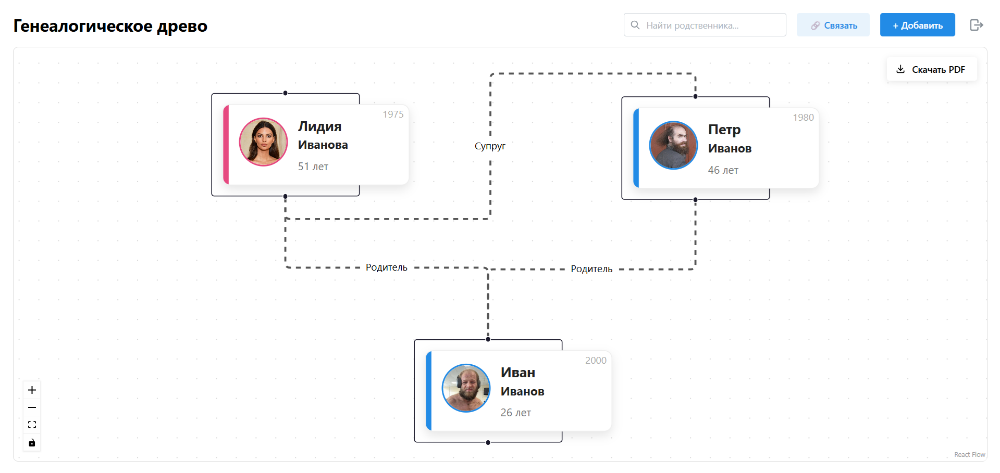
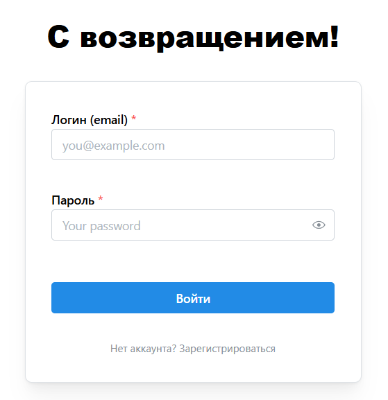
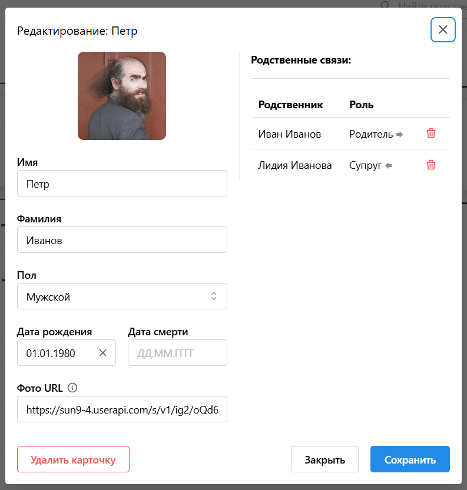

# 🌳 Генеалогическое древо (Family Tree App)

Веб-приложение для построения, визуализации и хранения истории семьи. Pet-проект с полноценным функционалом для ведения семейного архива.



## ✨ Возможности

- **📊 Интерактивный граф:** Визуализация связей с помощью React Flow. Автоматическая иерархическая расстановка (родители выше, дети ниже) + сохранение ручного перемещения карточек.
- **🗺 Миникарта:** Интерактивная миникарта с навигацией — кликом или перетаскиванием перемещаетесь по большому дереву.
- **🔒 Безопасная авторизация:** Регистрация и вход. Токен хранится в `httpOnly` куке — JavaScript не имеет к нему доступа. Каждый пользователь видит и редактирует только своё дерево.
- **🛠 Полный контроль данных:**
  - Добавление людей с фото (по URL), датами рождения/смерти и полом.
  - Создание связей любых типов: стандартных (Родитель, Супруг, Брат/Сестра) и кастомных (Дядя, Крёстный, любой другой).
  - Описание к каждой связи: редактируется прямо в карточке.
  - Умное редактирование: при клике на человека связи подписываются относительно него («Отец», «Сын», «Брат/Сестра»).
- **🏷 Подписи на линиях:** Тип каждой связи всегда виден на графе — удобно при печати.
- **🔍 Умный поиск:** Мгновенная фильтрация по имени с визуальной подсветкой совпадений.
- **📄 Экспорт в PDF:** Скачать изображение всего дерева в высоком качестве одной кнопкой.
- **🎨 Современный UI:** Чистый дизайн на базе Mantine UI, адаптивные модальные окна, русские календари.

## 📸 Скриншоты

### Вход и регистрация



### Редактирование персоны



## 🛠 Технологический стек

### Backend

| Компонент | Технология |
|---|---|
| Язык | [Go (Golang)](https://go.dev/) |
| Роутер | [Chi](https://github.com/go-chi/chi) |
| База данных | [SQLite](https://www.sqlite.org/) (`family_tree.db`) |
| Авторизация | JWT в `httpOnly` cookie |

### Frontend

| Компонент | Технология |
|---|---|
| Фреймворк | [React 19](https://react.dev/) + [Vite](https://vitejs.dev/) |
| UI | [Mantine UI v8](https://mantine.dev/) |
| Граф | [React Flow](https://reactflow.dev/) + [Dagre](https://github.com/dagrejs/dagre) |
| HTTP | [Axios](https://axios-http.com/) |
| Code Quality | ESLint + Prettier |

## 🚀 Запуск проекта локально

### Предварительные требования

- [Go](https://go.dev/dl/) версии 1.22+
- [Node.js](https://nodejs.org/) версии 20+

### 1. Запуск бэкенда

```bash
# Из корневой папки проекта
go mod tidy
go run main.go
```

Сервер запустится на `http://localhost:8080`.  
При первом запуске автоматически создастся файл `family_tree.db`.

### 2. Запуск фронтенда

```bash
# В новом терминале
cd web
npm install
npm run dev
```

Приложение будет доступно по адресу: `http://localhost:5173`.

### Полезные команды (Frontend)

```bash
# Форматирование кода
npm run format

# Проверка линтером
npm run lint
```

## 🔐 Безопасность

Токен авторизации хранится в `httpOnly` cookie — он недоступен через JavaScript, что защищает от XSS-атак.

При деплое на HTTPS раскомментируйте флаг `Secure` в `internal/handlers/auth.go`:

```go
http.SetCookie(w, &http.Cookie{
    // ...
    Secure: true, // раскомментировать в продакшене
})
```

---

Разработано с ❤️
